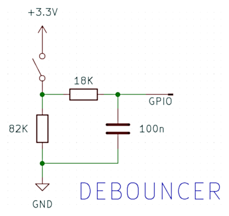

## GPIOWSSERVER

**Gpiowsserver** provides a WebSocket-based interface to the GPIO on a Raspberry Pi. It was developed to provide a backend for a React frontend to enable setting and reading GPIO pins in a web browser but should prove useful in its own right.

The code is written in TypeScript using the `ws` WebSockets and `onoff` GPIO access libraries. It runs (at least) on a Raspberry Pi Model B+ with 8GB of RAM, using 64-bit Raspberry Pi OS 12 (Bookworm) and the 6.6 kernel, this being the machine on which it was written. It has not been tested on other hardware although I see absolutely no reason why it should not work on a Pi 3 or 5.

### Request and response syntax

Requests ('commands') to and responses from the server are JSON objects, suitably serialized.

Commands have the following common format:

```json
{
  "command": "string"
}
```

Almost all commands, with the exception of the `getRegisteredPins` command, require a suitable `params` field.

```json
{
  "command": "string"
  "params": {
    "field 1": "..."
  },
}
```

An example (to read the state of a GPIO pin) is as follows:

```json
{
  "command": "readState",
  "params": {
    "pinName": "GPIO17"
  }
}
```

To _set_ the state of a pin high (3.3V) the following command could be used:

```json
{
  "command": "setState",
  "params": {
    "pinName": "GPIO21 ",
    "state": true
  }
}
```

Responses have a common format:

```json
{
  "messageType": "string",
  "data": {
    "field 1": "...",
    "field 2": "..."
  }
}
```

The response to query-type commands will have an appropriate `messageType` field with the body of the response in the `data` object. Responses to action-type commands will have a `messageType` of `ack`, with informational fields in the `data` object. For example, the response to the `readState` command above might be:

```json
{
  "messageType": "state",
  "data": {
    "pinName": "GPIO17",
    "state": false
  }
}
```

indicating that the pin is seeing a low logic level. The response to the `setState` command would be:

```json
{
  "messageType": "ack",
  "data": {
    "command": "setState",
    "pinName": "GPIO21"
  }
}
```

A full list of all commands and possible responses can be found in [commands](docs/commands.md).

#### Message IDs

Commands can also take an optional `messageId` field, for example thus:

```json
{
  "command": "readState",
  "messageId": "rs_1740502620010_C0A82211",
  "params": {
    "pinName": "GPIO17"
  }
}
```

to which a response might be:

```json
{
  "messageType": "state",  
  "messageId": "rs_1740502620010_C0A82211",
  "data": {
    "pinName": "GPIO17",
    "state": false
  }
}
```
The `messageId` is completely free-form. It is returned to the caller unaltered.

The server can also generate message IDs for state change events; see below.

### Configuration

The server reads a JSON-format configuration file at startup. By default, it looks for the file in `config/config.json`. If a `.env` file is located in the project root containing the key `SERVER_CONFIG_PATH` this value will be used instead.

The configuration file has the following format, with only `port` being mandatory:
```json
{
  "host": "string",
  "port": "number",
  "perMessageDeflate": "boolean",
  "generateId": "boolean",
  "pins": [
    {
      "pinName": "string",
      "direction": "in | out",
      "edge": "rising | falling | both",
      "debounceTimeout": "number"
    },
    {
    }
  ],
  "logger": {
    "useConsole": {
      "level": "info | warn | debug etc."
    },
    "useFile": {
      "level": "info | warn | debug etc."
      "logfilePath": "string"
    }
  }
}
```
The `perMessageDeflate` option is used to tell the server whether to compress responses. If in doubt, omit it or set it to `false`.

The `generateId` option is used to determine whether a state change response will have an associated `messageId` field. If it is set, the server's interrupt handler will generate a unique message ID. The ID is a version 4 UUID string, for example `84d872e2-f39a-11ef-85b3-5b7fbb5b5a30`. A state change response might therefore look like the following:

```json
{
  "messageType": "stateChange",
  "messageId": "84d872e2-f39a-11ef-85b3-5b7fbb5b5a30",
  "data": {
    "pinName":"GPIO17",
    "edge":"rising"
  }
}
```

The `pins` option is an array of pins that are to be registered at startup. Each element of the array takes a pin name, *e.g* `GPIO20`, a direction `in` or `out` and optionally `edge`, which tells the server to listen for logic level transitions on the pin and send a `stateChange` message if one is detected. The `edge` option is only applicable to pins with direction `in`.

The `debounceTimeout` option of an entry in `pins`, which also is only applicable to pins with direction `in`, controls the software debounce interval that the `onoff` library applies to logic level transitions. It is a number, in milliseconds,which specifies the time window after an initial transition during which subsequent transitions will not trigger an interrupt. After this time window has elapsed, the value on the pin will be sent to the interrupt handler. Alternatively, an input pin connected to, say, a microswitch, can be debounced in hardware. A simple circuit to do this is as follows:



This circuit has a time constant of 8.2ms, which is generally adequate, although adjustment may be needed. More sophisitcated techniques involving, for example, a Schmitt trigger would of course also be serviceable.

#### Logging
The `logger` option controls logging via the `winston` package. It has two options, `useConsole` and `useFile`. Both take a `level` option which is the log level at which messages of this type should appear. The `useFile` option takes a `logFilePath` aetting which is the destination for log messages.
